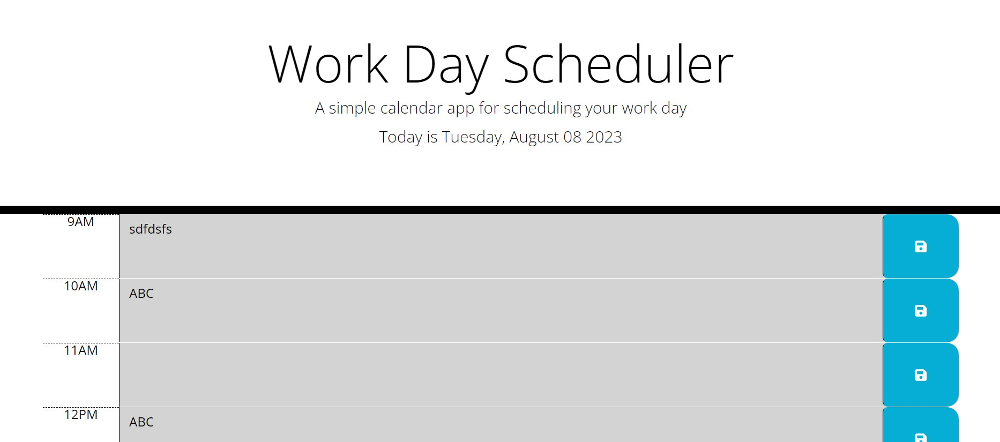

# W7-planner-app-lesson

## Description

The app can:

Display the current day at the top of the calendar when a user opens the planner.

Present timeblocks for standard business hours when the user scrolls down.

Color-code each timeblock based on past, present, and future when the timeblock is viewed.

Allow a user to enter an event when they click a timeblock.

Save the event in local storage when the save button is clicked in that timeblock.

Persist events between refreshes of a page.

## Installation
No installation is required. 
Deployed link: https://huihuihui07.github.io/W7-planner-app-lesson/
